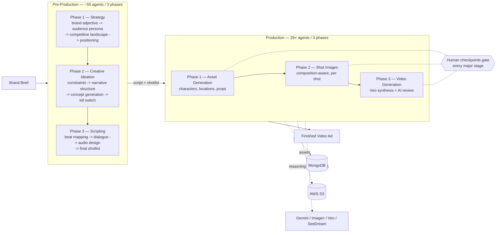

# Zeroshot Studio

**An end-to-end AI video ad production pipeline — from a brand brief to a finished video ad, with no camera and no film crew.**

Zeroshot Studio takes a brand brief (or a script) and runs it through two sequential AI pipelines — over 80 purpose-built agents in total — to produce a strategy, a shot-by-shot script, a full visual asset library, and finished video clips per shot. Every stage has a human-approval checkpoint, so the system is designed to augment a creative team, not replace review.

## What it does

| Stage | Input | Output |
|---|---|---|
| **Pre-Production** | Brand brief / product description | Strategic positioning, audience insight, creative concepts, a production-ready script + shotlist |
| **Production** | Script + shotlist | A visual asset library (characters, locations, props), composition-aware shot images, and finished video clips per shot |

Both stages are independent services that only communicate through MongoDB (keyed by `project_id`) — either can be run, inspected, and scaled on its own.

## Architecture



Every agent is a single-purpose async function that reads/writes MongoDB state directly and is orchestrated by [LangGraph](https://github.com/langchain-ai/langgraph) — there's no shared in-memory state passed between agents, so any agent can be re-run, replayed, or inspected independently by `project_id`.

A full breakdown of every agent, every phase, and every data-flow diagram is in [`docs/ARCHITECTURE.md`](docs/ARCHITECTURE.md).

## Tech stack

| Layer | Technology |
|---|---|
| API framework | FastAPI + Uvicorn |
| Workflow orchestration | LangGraph (one state machine per phase) |
| Async task queue | Celery + AWS SQS |
| Database | MongoDB Atlas |
| File storage | AWS S3 |
| Cache / rate limiting | Redis + slowapi |
| AI — text & reasoning | Google Gemini |
| AI — images | Google Imagen 4.0, SeeDream 4 Edit |
| AI — video | Google Veo 3.1 |
| Containerization | Docker |

## Repository structure

```
backend/services/
├── pre_production/          # Strategy -> creative concepts -> script (3 phases, standalone FastAPI apps)
│   ├── phase-1/              # Brand strategy (13 agents)
│   ├── phase-2/              # Creative ideation (25 agents)
│   └── phase-3/              # Script + shotlist (12 agents)
└── production/               # Script -> assets -> shot images -> video (FastAPI + Celery service)
    └── app/
        ├── api/v1/endpoints/ # REST routes
        ├── services/         # Phase 1-4 agent implementations
        ├── tasks/            # Celery task definitions
        └── models/           # MongoDB document models

docs/                         # Deep-dive architecture, API reference, and design docs
sample-output/                # A real script, shotlist, and rendered clip from an actual pipeline run
```

## Sample output

This isn't a demo you can spin up locally (see [Running this yourself](#running-this-yourself) below) — so here's what one pipeline run actually produced, from a generic test brief, unedited:

- [`sample-output/concept_a_script.fountain`](sample-output/concept_a_script.fountain) — the generated script in Fountain screenplay format, with camera direction, VO, and SFX/music cues
- [`sample-output/concept_a_shotlist.csv`](sample-output/concept_a_shotlist.csv) — the structured shot-by-shot breakdown (camera motion, angle, dialogue, product presence) derived from that script
- [`sample-output/shot_3.3.1_sample_clip.mp4`](sample-output/shot_3.3.1_sample_clip.mp4) — one rendered shot from that shotlist, generated via Veo

## Running this yourself

Being upfront about this: there's no `docker-compose.yml` and no seed/demo data, so this isn't a clone-and-run project. To actually execute the pipeline you need your own accounts and credentials for **all** of: MongoDB Atlas, AWS (S3 + SQS), Google Cloud (Gemini + Imagen + Veo — Veo access is separately gated by Google), and optionally OpenAI/Anthropic/Supabase depending on which agents you exercise. The three Pre-Production phases are also independent standalone services that need to be started and pointed at each other manually. If you just want to see what it does, the [sample output](#sample-output) above and the [architecture docs](docs/ARCHITECTURE.md) are the fastest path — running it end-to-end is a real infrastructure project in itself.

If you do want to run it:

**Requirements:** Python 3.11+, MongoDB Atlas cluster, Redis, AWS account (S3 + SQS), Google Cloud API access (Gemini / Imagen / Veo).

```bash
git clone <this-repo>
cd zeroshot-studio
python -m venv venv && source venv/bin/activate
pip install -r requirements.txt
```

Copy the environment template and fill in your own credentials — nothing in this repo will run without them:

```bash
cp backend/services/production/.env.example backend/services/production/.env
```

**Run the Pre-Production service** (strategy → script), one phase at a time:

```bash
cd "backend/services/pre_production/phase-1" && uvicorn main:app --reload --port 8005
```

**Run the Production service** (assets → images → video):

```bash
redis-server --daemonize yes
uvicorn backend.services.production.app.main:app --reload --port 8000
celery -A backend.services.production.app.celery_app worker --loglevel=info
```

Or via Docker:

```bash
docker build -f backend/services/production/Dockerfile -t zeroshot-production .
docker run -p 8000:8000 --env-file backend/services/production/.env zeroshot-production
```

## Documentation

- [`docs/ARCHITECTURE.md`](docs/ARCHITECTURE.md) — full agent-by-agent architecture diagrams for every phase
- [`docs/API_ENDPOINTS.md`](docs/API_ENDPOINTS.md) — REST API reference
- [`docs/PRODUCT_OVERVIEW.md`](docs/PRODUCT_OVERVIEW.md) — product scope, data models, environment variables, quota handling
- [`docs/PRODUCTION_PIPELINE_DEEP_DIVE.md`](docs/PRODUCTION_PIPELINE_DEEP_DIVE.md) — every agent, prompt, schema, and storage pattern in the Production service
- [`docs/PHASE_4_POST_PRODUCTION.md`](docs/PHASE_4_POST_PRODUCTION.md) — post-production/editing assembly stage
- [`docs/HUMAN_CHECKPOINT_DESIGN.md`](docs/HUMAN_CHECKPOINT_DESIGN.md) — design for the human image-review approval gate
- [`docs/PRODUCT_IMAGE_PIPELINE.md`](docs/PRODUCT_IMAGE_PIPELINE.md) — product-image fidelity pipeline

## License

MIT — see [LICENSE](LICENSE).
