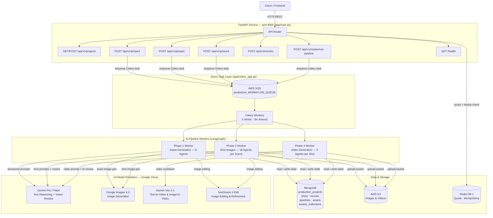
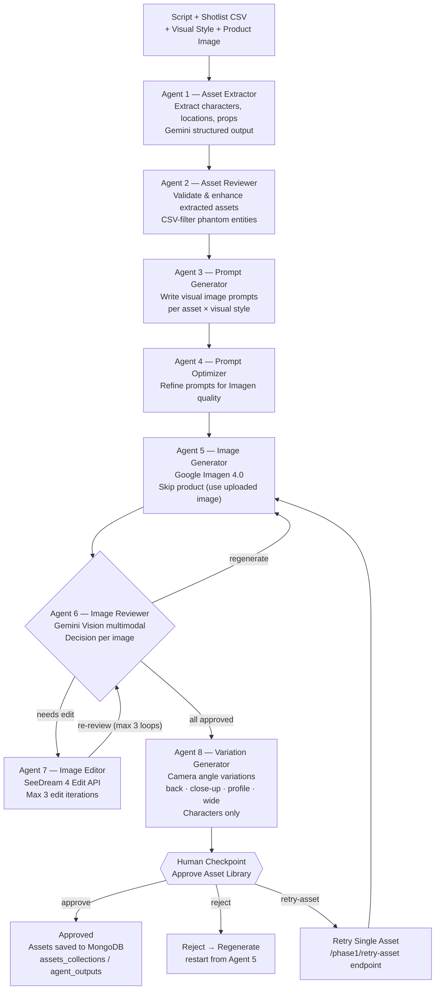
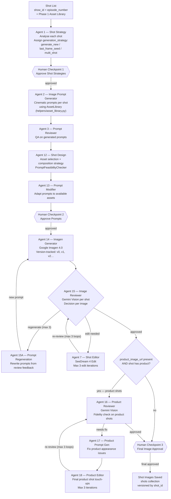
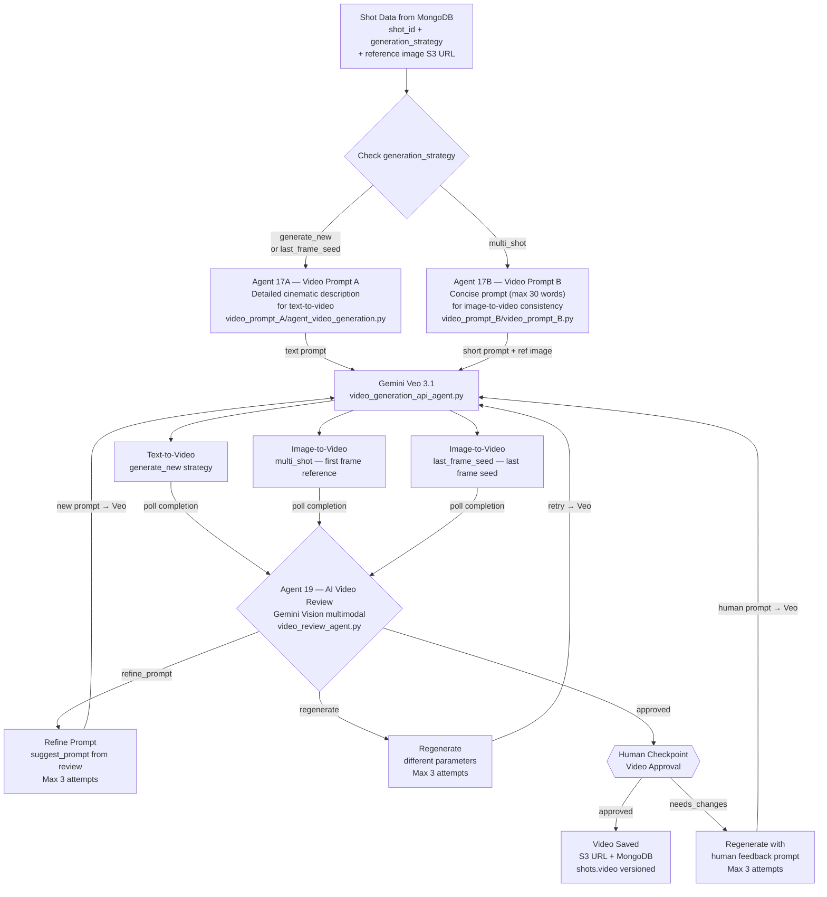
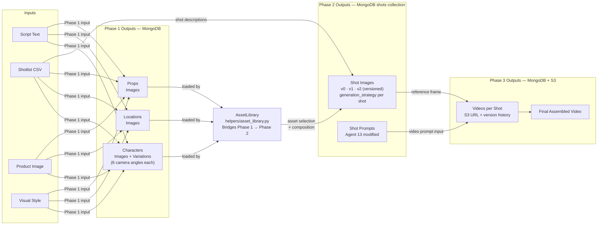

# Zeroshot Studio — Architecture Diagrams

---

## 1. System Overview

End-to-end infrastructure: client request → API → async task queue → AI pipeline workers → storage + AI models.

---

## 2. Pre-Production Pipeline (Strategy → Script)

Three sequential phases transforming a brand brief into a production-ready shotlist.

```mermaid
graph LR
    Brief["Brand Brief\nCompany + Product Info"]

    subgraph PreProd1["Pre-Production Phase 1 — Strategic Foundation"]
        direction TB
        PP1_1["Company Research"]
        PP1_2["Visual Context Extraction"]
        PP1_3["Brand Adjective Agent"]
        PP1_4["Audience Persona"]
        PP1_5["Competitive Landscape"]
        PP1_6["Central Human Truth"]
        PP1_7["Value Prop & Offer"]
        PP1_8["Truest Thing"]
        PP1_9["Conflict Identification"]
        PP1_10["Insight Validation"]
        PP1_11["Truth Conflict Platform"]
        PP1_12["Strategy Models"]
        PP1_13["Positioning Alignment"]
        PP1_1 --> PP1_2 --> PP1_3 --> PP1_4 --> PP1_5 --> PP1_6
        PP1_6 --> PP1_7 --> PP1_8 --> PP1_9 --> PP1_10 --> PP1_11 --> PP1_12 --> PP1_13
    end

    subgraph PreProd2["Pre-Production Phase 2 — Creative Development"]
        direction TB
        PP2_1["Creative Constraint Manager"]
        PP2_2["Constraint Priority Resolver"]
        PP2_3["Idea Core Preservation"]
        PP2_4["Brand Guideline Alignment"]
        PP2_5["Video Type Selection"]
        PP2_6["Duration Structuring"]
        PP2_7["Scene Deconstruction"]
        PP2_8["Scene Role Enumeration"]
        PP2_9["Scene Role Selector"]
        PP2_10["Temporal Placement Solver"]
        PP2_11["Scene Integration Plan"]
        PP2_12["Narrative Skeleton Generator"]
        PP2_13["Narrative Skeleton Planner"]
        PP2_14["Narrative Archetype Selector"]
        PP2_15["Platform Behavior Optimizer"]
        PP2_16["Pattern Interrupt Generator"]
        PP2_17["Viral Mechanics Agent"]
        PP2_18["Mental Model Transformer"]
        PP2_19["Intergalactic Thinking"]
        PP2_20["Concept Generator"]
        PP2_21["Offer Narrative Integrator"]
        PP2_22["Concept Categorization"]
        PP2_23["Concept Diversity Controller"]
        PP2_24["Interest Filter"]
        PP2_25["Concept Kill Switch"]
        PP2_1 --> PP2_2 --> PP2_3 --> PP2_4 --> PP2_5 --> PP2_6 --> PP2_7
        PP2_7 --> PP2_8 --> PP2_9 --> PP2_10 --> PP2_11 --> PP2_12 --> PP2_13
        PP2_13 --> PP2_14 --> PP2_15 --> PP2_16 --> PP2_17 --> PP2_18 --> PP2_19
        PP2_19 --> PP2_20 --> PP2_21 --> PP2_22 --> PP2_23 --> PP2_24 --> PP2_25
    end

    subgraph PreProd3["Pre-Production Phase 3 — Audio-Visual Scripting"]
        direction TB
        PP3_1["Beat to Timeline Mapper"]
        PP3_2["Offer Integration Planner"]
        PP3_3["Visual Sequencing"]
        PP3_4["AV Separation"]
        PP3_5["Voiceover Writer"]
        PP3_6["Dialogue Agent"]
        PP3_7["Audio Design"]
        PP3_8["Rhythm & Pacing Regulator"]
        PP3_9["Loop Optimization"]
        PP3_10["Constraint Compliance QA"]
        PP3_11["Shot Level Script Formatter"]
        PP3_12["Final Shotlist Agent"]
        PP3_1 --> PP3_2 --> PP3_3 --> PP3_4 --> PP3_5 --> PP3_6
        PP3_6 --> PP3_7 --> PP3_8 --> PP3_9 --> PP3_10 --> PP3_11 --> PP3_12
    end

    ShotlistOutput["Production-Ready Shotlist\n+ Script + Audio Specs"]

    Brief --> PP1_1
    PP1_13 -->|"strategy + insights"| PP2_1
    PP2_25 -->|"approved concepts"| PP3_1
    PP3_12 --> ShotlistOutput
    ShotlistOutput -->|"input to Production Phase 1"| ProdP1["Production Pipeline"]
```

---

## 3. Production Phase 1 — Asset Generation (Agents 1–8)

Takes the script and generates a complete visual asset library (characters, locations, props) with AI-reviewed images and camera-angle variations.

---

## 4. Production Phase 2 — Shot Image Generation (Agents 1–18)

Runs **per scene**. Uses Phase 1 asset library to generate composition-aware images for every shot. Three human checkpoints gate strategy, prompts, and final images.

---

## 5. Production Phase 3 — Video Generation (Agents 17–19)

Runs **per shot**. Reads shot images from MongoDB, selects the right prompt strategy, calls Gemini Veo 3.1, applies AI review, then human approval.

---

## 6. Full Production Data Flow

How data passes between phases end-to-end.

